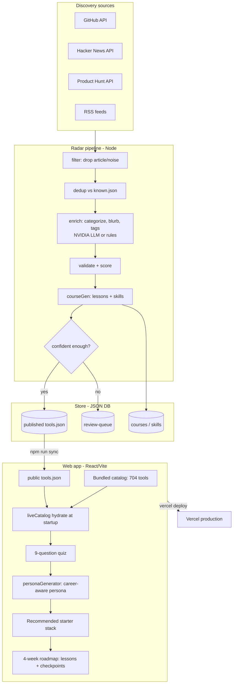

# Toolnaut — Role-Aware AI Tool Discovery & Learning

Toolnaut helps people cut through AI-tool overload. A 60-second quiz builds a
**career-aware persona**, recommends a **starter stack** from a catalog of 700+
tools, and charts a **4-week learning roadmap** with lessons and checkpoints. A
background **radar pipeline** discovers, enriches, and publishes new AI tools
automatically, so the catalog stays fresh with no human in the loop.

- **Live:** https://toolnaut.xyz
- **Stack:** React 19 · Vite · React Three Fiber (3D galaxy) · Framer Motion · Tailwind 4 · Node radar pipeline · Vercel

---

## Architecture at a glance

Two systems share one catalog: the **web app** (what users see) and the **radar
pipeline** (what keeps the catalog alive). They meet at `public/tools.json`.



**The autonomous loop:** sources → filter → dedup → enrich → validate → course →
publish → sync → deploy → the app hydrates the new tool → the quiz recommends it.

---

## The web app

| Route | Purpose |
|-------|---------|
| `/` | 3D galaxy landing (hero, capabilities, contact) |
| `/quiz` → `/quiz/result` | 9-question quiz → career-aware persona + starter stack |
| `/app/stack` · `/discover` · `/tools/:slug` | Your tools · browse the catalog · tool detail |
| `/app/learning` | 4-week roadmap: expandable lessons + gating checkpoints |
| `/app/community` · `/settings` | Threads · preferences |

**How a recommendation is made**
1. `quizLogic.js` — 9 questions capture domain, **role**, **career stage**, experience, goal, budget, **pace**, learning style, blocker.
2. `personaGenerator.js` — turns answers into a persona (e.g. *Ambitious Designer · Senior Designer*), picks the top-3 starter stack from the catalog, and suggests a plan tier (Student / Pro / Team).
3. `roadmapGenerator.js` — builds a 4-week roadmap; **pace** scales the number of steps, each step carries a lesson, and each week ends with a checkpoint quiz that gates the next week.

**Catalog hydration** — `liveCatalog.js` fetches `/tools.json` (the radar's
output) at startup and merges any new tools over the bundled 704. A missing file
is a safe no-op, so the app always renders.

**Play modes** — a theme switcher (`themeStore.js`) swaps the accent palette
(Nebula / Solar / Toxic / Synth) live via CSS variables.

---

## The radar pipeline (`radar/`)

A standalone Node pipeline. Runs with **zero keys** (public sources + rule-based
enrichment → review queue); keys unlock AI enrichment + auto-publish.

```
radar/
├── run.js            # entry: loads env, runs the pipeline, logs a summary
├── env.js            # auto-loads radar/.env (gitignored)
├── config.js         # all config from env, with safe defaults
├── sources/          # github · hackernews · producthunt · rss connectors
├── filter.js         # drops article/headline noise (is-it-a-tool)
├── dedup.js          # skips tools already in known.json
├── enrich.js         # categorize · blurb · tags (LLM or rules)
├── llm.js            # provider-agnostic: Anthropic -> NVIDIA -> OpenAI -> OpenRouter
├── validate.js       # schema + confidence scoring
├── courseGen.js      # generates lessons + skills per tool
├── store/            # JSON DB (published, review-queue, courses, known)
└── scripts/sync-to-app.js  # published tools -> ../public/tools.json
```

**Run it**
```bash
cd radar
cp .env.example .env      # add keys (optional — see below)
npm test                  # pipeline tests
node run.js               # hunt -> enrich -> store
npm run sync              # push published tools to the app
node run.js && npm run sync   # full cycle
```

**Keys** (`radar/.env`, gitignored — never committed):

| Key | Effect |
|-----|--------|
| `NVIDIA_API_KEY` | AI enrichment + auto-publish (biggest power-up) |
| `GITHUB_TOKEN` | higher GitHub hunt rate limit |
| `PRODUCTHUNT_TOKEN` | enables the Product Hunt source |

LLM provider is auto-selected (Anthropic → NVIDIA → OpenAI → OpenRouter); the
first key present wins. NVIDIA uses `meta/llama-3.1-70b-instruct` by default.

---

## Run & deploy the app

```bash
npm install
npm run dev      # http://localhost:3000
npm run build    # production build -> dist/
vercel deploy --prod --yes   # deploy to Vercel (project already linked)
```

The app is a client-rendered SPA. `vercel.json` rewrites all routes to
`index.html`. Deploys are linked to the Vercel project **nexus**.

The brand name lives in one place — `src/config.js` (`BRAND`).

---

## Status

Beta — web-first. The discovery → recommend loop is live and autonomous. Known
follow-ups: SSR/prerender for SEO crawlability, a mobile navigation menu, and
scheduling the radar (cron / GitHub Action) for daily unattended runs.
